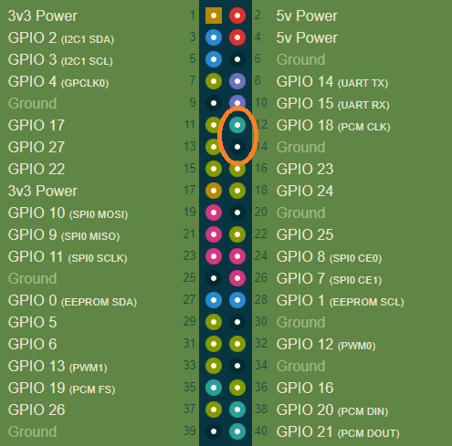

### Current Skills

<table>
    <tr>
        <th>Invocation Phrases</th>
        <th>Intent in Alexa Dash</th>
        <th>Loop Function</th>
        <th>Function Called</th>
    </tr>
    <tr>
        <td>turn off lights</td>
        <td>turnOffIntent</td>    
        <td>No</td>    
        <td>light_string.setSolid, {"color": LedColor.black}</td>
    </tr>
    <tr>
        <td>Start Rainbow Chase</td>
        <td>setRainbowChaseIntent</td>
        <td>Yes</td>    
        <td>light_string.rainbowCycle</td>
    </tr>
    <tr>
        <td>start slow color changing</td>
        <td>slowRandomTransitionIntent</td>    
        <td>Yes</td>    
        <td>
            light_string.transition_to_random_color, {"wait_after_transition_ms": 1}
        </td>
    </tr>
    <tr>
        <td>solid random colors</td>
        <td>solidRandomIntent</td>    
        <td>No</td>    
        <td>light_string.random_colors</td>
    </tr>
</table>

## Hardware
### Pinout
